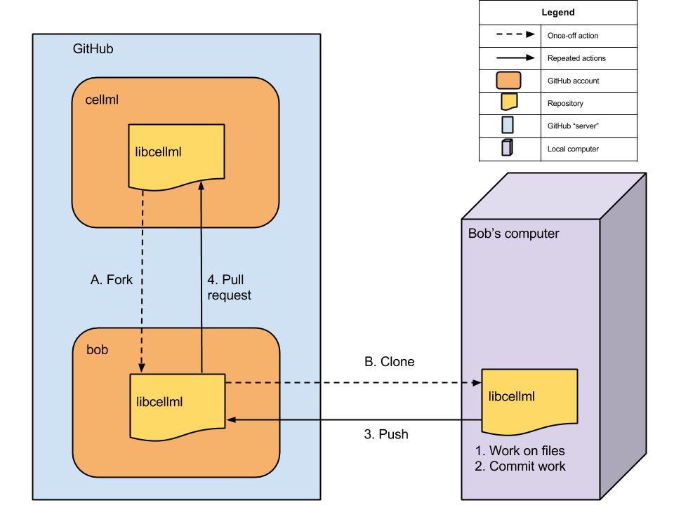

.. _Contributor Setup for libCellML:

=================
Contributor Setup
=================

This section describes how someone wanting to contribute to the libCellML project should set up their *working copy*.

.. contents::

Overview
========

Before you begin you will need to have a few prerequisites satisfied:

#. GitHub user account (if necessary, create one using this link https://github.com/join ) (for the rest of this document we will call our user *bob*)
#. A Git client installed (see http://git-scm.com/downloads and http://git-scm.com/downloads/guis )

This document doesn't cover the process of satisfying these prerequisites in any further detail.  The remainder of this document assumes that these prerequisites have been met.

The goal here is to get a working copy of the project's files (i.e. source code, tests, and documentation, etc.) onto your computer so that you can begin working.  Firstly, you need to fork the prime libCellML repository, make a clone onto your computer, and set up the Git remotes.  **Figure 1** shows some of these setup actions and the resulting setup.  It also shows the information flow for making contributions (steps 1 to 4).

   
   **Figure 1**: Setup of repository fork and clone

The three steps to getting set up are detailed below.

Forking your own copy
=====================

Login to GitHub with your user name and go to::

  https://github.com/cellml/libcellml

and fork this repository into your own GitHub user account.  This is done by clicking on fork.

Clone
=====

You now need to clone the libcellml repository to your computer.  You do this by going to your fork (in this example, user bob's fork) at:

  https://github.com/bob/libcellml

.. note:: Don't clone this location.  Substitute your own GitHub user name in place of *bob*.

On the right hand side of the web page on your fork of the repository you can get the link for cloning the repository to your computer, in our example::

  https://github.com/bob/libcellml.git

Now clone the repository. If using git from the command line on a Unix-like system, this is done as follows::

  cd /somewhere/you/keep/project/files
  git clone https://github.com/bob/libcellml.git

.. note:: Again, don't clone this location. Substitute your own user name in place of *bob*.

Set Git remotes
===============

You now need to setup a read-only remote connection to the prime repository. To do this from the command line::

  cd libcellml
  git remote add prime https://github.com/cellml/libcellml
  git config remote.prime.pushurl "you really didn't want to do that" #This is optional

.. note:: The third command is optional, and only recommended if you have sufficient permission to push directly to the prime repository.

You have now added a new remote named **prime** and set origin as the default fetch and push location to point at your fork on GitHub.  Here **prime** is a reference to the main definitive repository where releases are made for the libCellML project.  You have also optionally also set the **prime** repository as read-only by setting an invalid push URL.

Finally
=======

This completes the set up.  Next, read :doc:`Contributing <libcellml-development-contribution>`, which explains how to get your changes accepted into libCellML's prime repository.
